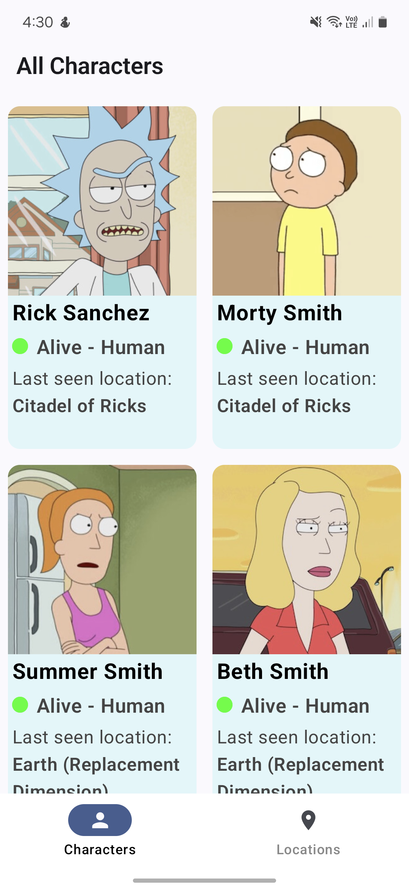
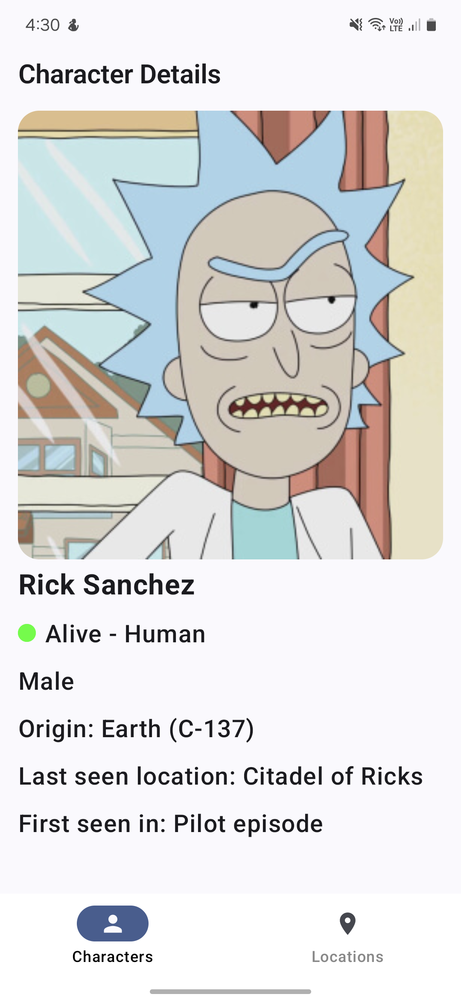
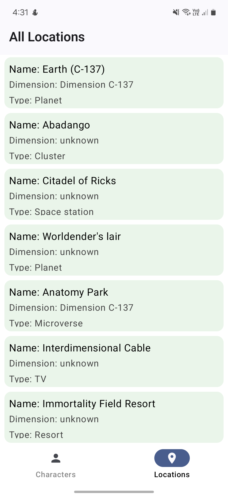
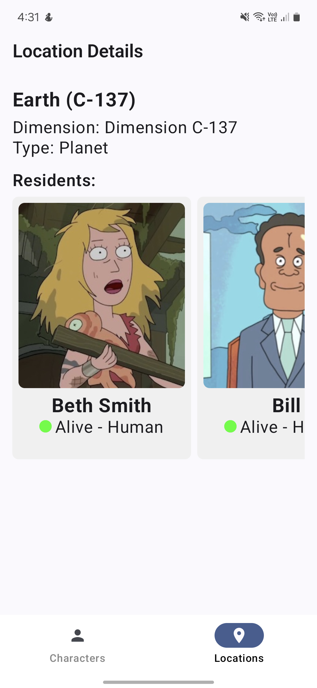

# Rick and Morty Explorer App

A simple Android app to browse characters and locations from the [Rick and Morty API](https://rickandmortyapi.com/), built using modern Android development practices.

---

## ✨ Features

* **Characters Screen**

  * Grid list of characters with image, name, and status
  * Pagination support
  * Tap to view character details

* **Character Detail Screen**

  * Image, name, species, origin, location, and episodes

* **Locations Screen**

  * List of locations with name, type, and dimension

* **Location Detail Screen**

  * Location details
  * Horizontally scrollable list of residents (characters)

---

## 🪤 Tech Stack

| Layer                | Library                    |
| -------------------- | -------------------------- |
| UI                   | Jetpack Compose            |
| Navigation           | Jetpack Navigation Compose |
| Dependency Injection | Hilt                       |
| Networking           | Retrofit + OkHttp          |
| Image Loading        | Coil                       |
| Async                | Kotlin Coroutines + Flows  |

---

## ⚖️ Dependencies

```kotlin
// Retrofit
    implementation (libs.retrofit)
    implementation (libs.converter.gson)
    implementation(libs.okhttp)
    implementation(libs.logging.interceptor)

    // Hilt
    implementation(libs.hilt.android)
    implementation(libs.androidx.hilt.navigation.fragment)
    ksp(libs.hilt.compiler)

    // Coil
    implementation(libs.coil.compose)
    implementation(libs.coil.network.okhttp)

    // Compose
    implementation("androidx.compose.ui:ui")
    implementation(libs.androidx.navigation.compose)

// Coroutines & Flow
implementation("org.jetbrains.kotlinx:kotlinx-coroutines-core")
implementation("org.jetbrains.kotlinx:kotlinx-coroutines-android")
```

---

## 👷 Setup

1. Clone the repo
2. Build and run

---

## 🎓 Learnings

* Using Compose for responsive UI
* Async data loading with Kotlin Flows
* Clean architecture with Hilt for DI
* Lazy loading and state handling

---

## 🌐 API Reference

* [https://rickandmortyapi.com/documentation](https://rickandmortyapi.com/documentation)

---

## ✨ Screenshots





---

